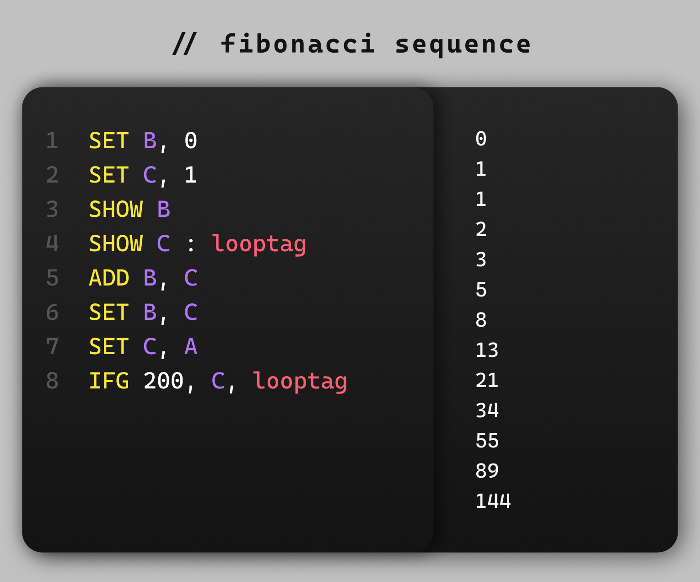
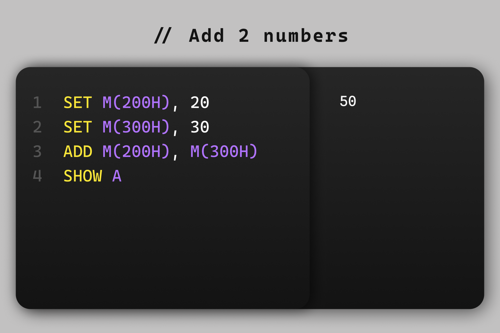

<br />
<div align="center">
  <a href="https://github.com/othneildrew/Best-README-Template">
    
  </a>

  <h3 align="center">R.S.O.C.</h3>

  <p align="center">
    A custom built programming language
    <br />
    <br />
  </p>
</div>


<!-- ABOUT THE PROJECT -->
## ✔ About The Project

R.S.O.C. is a custom built programming language very similar to a low-level 8085 programming language. This is made using Python and is under development.

### Code to generate the fibonacci sequence:



### 🏃‍♂️ Installation & Usage

1. Clone the repo
   ```sh
   git clone https://github.com/RaviMauryaHootowl/R.S.O.C..git
   ```
2. Enter your code in code.txt file
   
4. Run the run.py file
   ```sh
   python run.py
   ```

## ✍ R.S.O.C Tutorial

### 🤖 Architecture
R.S.O.C. comes with a memory size of 65536 locations and 7 Registers(A-G)  
Memory is represented within M() Eg. M(2000H)  
This denotes memory location with hex index of 2000  
Registers are represented by their letter which ranges from A to G  

### 📃 Instruction Set
1. SET: Used to set a memory or register from another memory, register or data.  
Eg.
```
    SET A, B
    SET A, 20
    SET M(2001H), 40
```

2. SHOW: Used to print the value of a memory or register.  
Eg.
```
    SHOW A
    SHOW M(2000H)
```

3. SKIP: Empty and Useless line just like your life (jk)  
Eg.
```
    SKIP
```

4. ADD, SUB, MUL, DIV: Performs arithmetics on two numbers and stores into A Register (Accumulator)  
Eg.
```
    ADD A, B
    ADD C, M(2000H)
    ADD 30, 40
    SUB A, B
    MUL B, C
    DIV C, D
```

5. INR/DCR: Used to Increment or Decrement value  
Eg.
```
    INR A
    DCR M(1000H)
```
6. IFG: If greater conditional jump to a label.  
Eg. Here since A is greater than 10 it jumps to `jumptag` label
```
    SET A, 20
    IFG A, 10, jumptag
    ...
    ...
    SHOW A : jumptag
```

7. IFL, IFE, IFN:  
IFL: If Less  
IFE: If Equal  
IFN: If Not Equal  

8. Pointers: X(A) is used to access the memory location whose memory address is in register A.
Eg. 
```
    SET A, 100H
    SET X(A), 20
    ~ This is print 256 as it's decimal value of 100H
    SHOW A
    ~ This will print 20
    SHOW X(A)
```

9. Comments: These are represented by ~ (tilde) symbol which is also the logo of R.S.O.C.  
Eg.  
```
    SET A, 20
    ~ This is a comment line
    SHOW A
```


## ✨ Sample Programs

